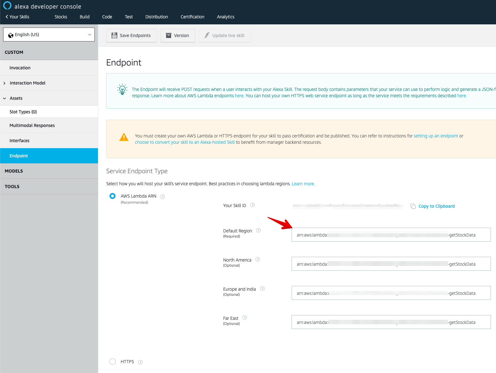

# Alexa skill: Stock market tracker


This is a NodeJS application built using the Serverless framework, AWS Lambda, DynamoDB, and [Yahoo Finance API](https://english.api.rakuten.net/apidojo/api/yahoo-finance1).

## Why
You trigger your Alexa skill and she tells you the market news related only to your stocks
## Before getting started
- Install `NodeJS`
- Install `AWS cli` and `serverless framework cli`

## How to install
- `npm i`
- Edit the `env.yml` file
- `sls deploy`
- Add an array of your stocks with their original value in the `stocks.json` file. Example:
```json
[
    {
        "name": "Verizon Communications Inc.",
        "price": 61.5,
        "qty": 100,
        "symbol": "VZ"
    }
]
```
- `npm run upload`
- Copy the lambda address from the terminal and use one to build your Alexa skill



## How it works
###   npm run upload
- This command uploads your stocks from `stocks.json` file to your dynamodb table
- Behind scenes, we run two cron-jobs. The first one is to track your current stock prices once a day and the second one - every 5 minutes.
- The application includes 4 lambda functions:
###  Lambda updateStockDataCron

- Invokes the `getUser` lambda function
- Gets current stock market data from [Yahoo Finance API](https://english.api.rakuten.net/apidojo/api/yahoo-finance1)
- Invokes the `updateUser` lambda function
    - Update the previous data section once a day
    - Update the current data section every 5 minutes
###  Lambda getStockData

- Invokes the `getUser` lambda function
- Generate phrase and response for Alexa device
###  Lambda getUser
- Get user data from a DynamoDB table

###  Lambda updateUser
- Update user data in a DynamoDB table

